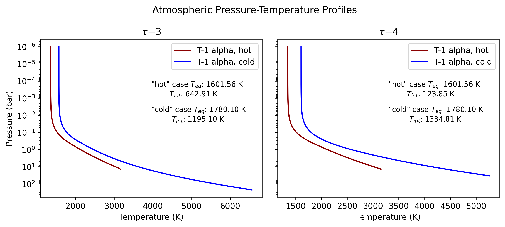

MOAChi atmospheric profiles for CHILI intercomparison project. The version of MOAChi used will be made public by Q3 2026.

#### Notes:
- See https://github.com/projectcuisines/chili/blob/main/intercomparison/analysis_static/static_model_outputs_csv.csv for 
the input data grid. Data pre-processing and run configuration are recorded in the intercomparison/input/moachi folder. 
- For the Trappist-1 alpha $\tau = 3$ and $\tau = 4$ cases, MOAChi produces a cooler surface temperature for the nominally "hot"
cases, and vice versa. This behavior stems from the fact that the nominally "cold" cases have both higher ASR and higher internal
heat flux. Since MOAChi uses a dual-grey opacity, the effects of e.g. atmospheric composition are not represented.

- The >5000 K surface temperatures for these "cold" cases also stretches the realism of the pure C-O-H thermochemical network 
in MOAChi. However, as it is constructed to constrain the atmospheric height, a lower-order task, rather than detailed atmospheric
composition and structure, we deemed this discrepancy acceptable. Please refer to Section 4.3.4 of the source paper 
(https://iopscience.iop.org/article/10.3847/1538-4357/ad6f03) for a more in-depth discussion.
- Contact Bo Peng (bpengeps@stanford.edu) for additional information. 